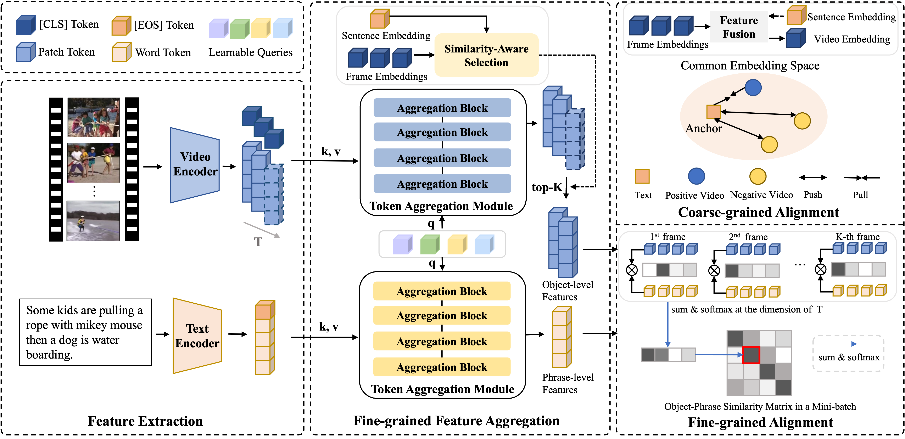

# Selective Multi-grained Alignment for Text-Video Retrieval

## Introduction
The implementation of paper Selective Multi-grained Alignment for Text-Video Retrieval.  


## Requirement

```bash
pip install ftfy regex tqdm
pip install opencv-python boto3 requests pandas
```
## How to Run
(1) Data prepare  
Please refer to [CLIP4Clip:Data Preparing](https://github.com/ArrowLuo/CLIP4Clip) to download MSR-VTT, MSVD, ActivityNet, and DiDeMo.  
(2) About the running scripts  
For MSR-VTT
```bash

job_name=msrvtt_vit32
DATA_PATH="[Your MSRVTT data path]"
python -m torch.distributed.launch --nproc_per_node=2 \
my_retrieval_ca.py --do_train --num_thread_reader=8 \
--lr 1e-4 --epochs=5 --batch_size=128 --n_display=50 \
--train_csv ${DATA_PATH}/MSRVTT_train.9k.csv \
--val_csv ${DATA_PATH}/MSRVTT_JSFUSION_test.csv \
--data_path ${DATA_PATH}/MSRVTT_data.json \
--features_path ${DATA_PATH}/MSRVTT_Videos \
--output_dir ckpts/${job_name} \
--max_words 32 --max_frames 12 --batch_size_val 40 \
--datatype msrvtt --expand_msrvtt_sentences \
--feature_framerate 1 --coef_lr 1e-3 \
--freeze_layer_num 0  --slice_framepos 2 \
--loose_type --linear_patch 2d --sim_header seqTransf \
--pretrained_clip_name ViT-B/32 \
--select_frame 4 --video_num_embeds 4 --txt_num_embeds 4 \
--spm_depth 4 --spm_vid_pos_enc_type none --spm_txt_pos_enc_type sine \
--dropout 0.1 --spm_pre_norm --spm_activation gelu --spm_last_ln --spm_residual --spm_residual_norm --spm_weight_sharing \
--spm_ff_mult 4 --fi 0.3 --lamda 0.025
```

## Acknowledgments
Our code is based on [CLIP4Clip](https://github.com/ArrowLuo/CLIP4Clip).

